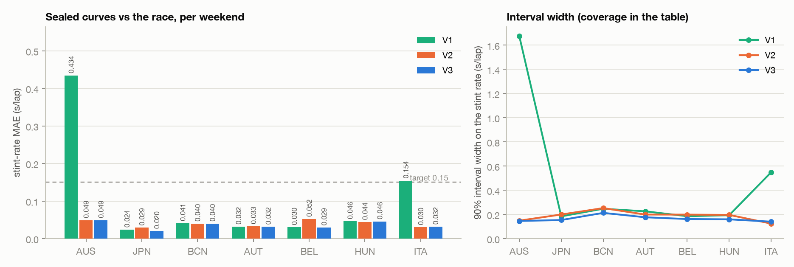
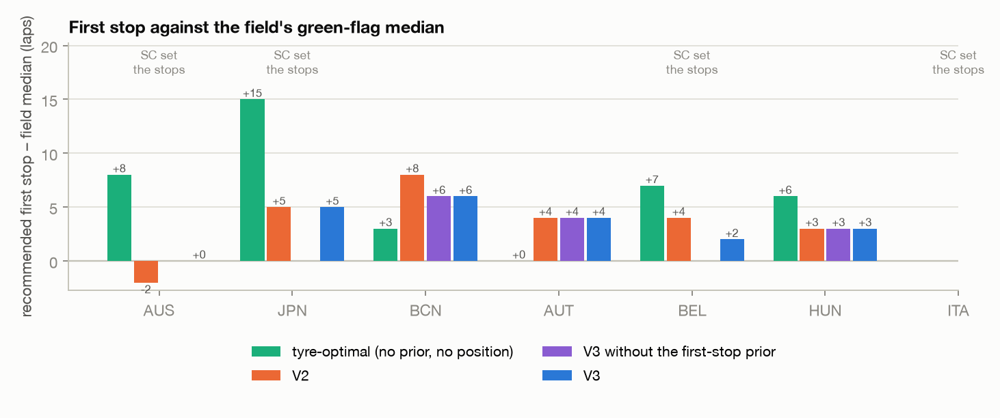
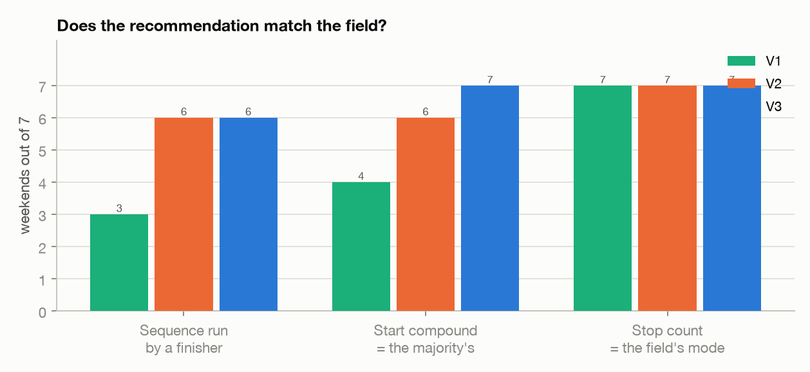
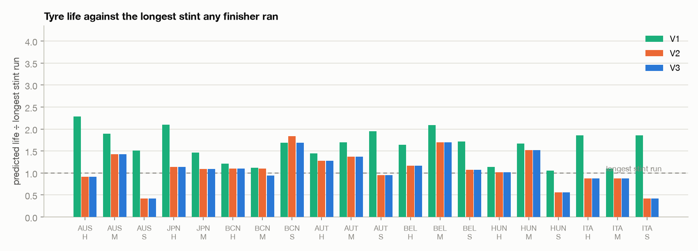
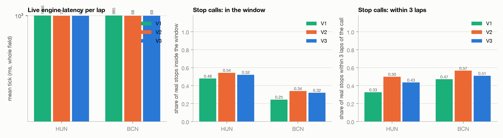
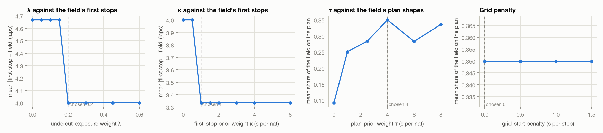

# degless benchmark, V3 — nomination-aware history, a first-stop prior, and three engineering cycles

*Benchmarked 12 September 2026 on the same seven dry, conventional 2026 weekends as V1 and V2 (Australia, Japan, Barcelona, Austria, Belgium, Hungary, Italy) and the same 196 race stints (`bench/out/accuracy.json` `population` block: 23, 19, 31, 40, 19, 43, 21 — unchanged from V1 through V3). V3 was run from scratch: fit all seven weekends, leave-one-out recalibration, decide all seven, then the benchmark suite, exactly as `make history && make benchmark` runs it (timings in `bench/out/history_timing.tsv` and `bench/out/runtime.json`). No benchmark definition changed except the additions the planner's notes name — cov95, a per-family first-stop prior, collapse metrics, and three-way improved/unchanged/regressed/not-meaningfully-changed verdicts. V2 remains frozen under `bench/v2/` and V1 under `bench/baseline/`; every V1/V2 number quoted here is this run's re-scoring of those frozen predictions with the current code, not necessarily what their own reports printed (see §2's footnote on oracle regret). Reproduce with `make history && make benchmark`.*

## 1. Executive summary

| Metric | V1 | V2 | V3 | Verdict |
|---|---|---|---|---|
| Degradation-rate error vs the race (stint-rate MAE, mean, s/lap) | 0.109 | 0.040 | **0.035** | improved |
| Worst weekend's stint-rate MAE (s/lap) | 0.434 | 0.052 | **0.049** | improved |
| Stop count = the field's mode (of 7) | 7 | 7 | **7** | unchanged |
| Compound sequence run by at least one finisher (of 7) | 3 | 6 | **6** | unchanged |
| Start compound = the majority's (of 7) | 4 | 6 | **7** | improved |
| Mean \|first stop − field green-flag median\| (laps, 3 non-SC weekends) | 5.000 | 5.000 | **4.333** | improved |
| Share of the field's first stops inside the model's window | 0.230 | 0.303 | **0.361** | improved |
| Median predicted tyre life ÷ longest stint run (1.0 is honest) | 1.679 | 1.094 | **1.084** | not meaningfully changed |
| Oracle regret of the tool's plan (s, true race rates) | 13.165 | 11.781 | **9.399** | improved |
| Live engine tick, whole field (ms, mean over 2 replays) | 1070.2 | 70.8 | **74.8** | regressed |
| Tests passing | 20 | 27 | **38** | improved |

**Bottom line.** V3 fixes what V2 got wrong at the margins rather than rewriting the model. Degradation error is pooled at the noise floor (0.035 s/lap against an in-sample oracle of 0.036), every weekend clears the 0.15 s/lap gate, and Belgium's regime miscalibration is gone (0.052 → 0.029). The nomination mapping and the enforced ladder gate hold V2's sequence and start-compound gains and add a seventh start match. Oracle regret of the tool's own plan falls to 9.4 s. What did **not** move by nearly enough is the thing this brief asked about first: **first-stop timing improves only modestly, and not by the prior** — mean error falls from 5.0 to 4.33 laps; the whole gain over V2 is Barcelona's plan-family change under the nomination mapping, the first-stop prior does not move any scored first stop (its leave-one-out weight is 0 at Barcelona and Hungary, and Austria sits on the prior's own mode), and the undercut term only holds Austria and Hungary where V2 already had them. The λ×κ diagnostic shows why: at Barcelona and Austria the 2026 field stopped earlier than any year of the circuit's own history, which is what the prior is built from. The live engine ticks a little slower than V2 (75 ms vs 71 ms, still 2.5× under the 200 ms target) for a broader signal set, and three of its stop-call metrics regress in absolute terms.

## 2. V1 → V2 → V3 comparison

| Metric | V1 | V2 | V3 | Δ V3−V2 | Verdict |
|---|---|---|---|---|---|
| Degradation-rate error vs the race (stint-rate MAE, s/lap, mean over weekends) | 0.109 | 0.040 | **0.035** | -0.004 | improved |
| Worst weekend's stint-rate MAE (s/lap) | 0.434 | 0.052 | **0.049** | -0.003 | improved |
| Stint-rate bias (s/lap, mean over weekends; 0 is best) | -0.083 | -0.011 | **-0.004** | +0.008 | improved |
| 90% interval coverage on the stint rate | 0.879 | 0.945 | **0.912** | -0.033 | not meaningfully changed |
| 95% interval coverage on the stint rate | 0.944 | 0.959 | **0.940** | -0.019 | not meaningfully changed |
| 90% interval width on the stint rate (s/lap) | 0.466 | 0.188 | **0.164** | -0.024 | improved |
| Practice posterior × regime, no circuit history (stint-rate MAE) | 0.037 | 0.045 | **0.038** | -0.007 | improved |
| MixedLM slope × regime (the frequentist baseline) | – | – | **0.043** | – | unavailable |
| Compound sequence run by at least one finisher | 3 | 6 | **6** | 0 | unchanged |
| Start compound = the majority's | 4 | 6 | **7** | 1 | improved |
| Stop count = the field's mode | 7 | 7 | **7** | 0 | unchanged |
| Mean share of the field that ran the recommended sequence | 0.153 | 0.329 | **0.350** | +0.021 | improved |
| Mean \|first stop − field green-flag median\| (laps, non-SC weekends) | 5.000 | 5.000 | **4.333** | -0.667 | improved |
| Mean signed first stop − field median (laps, non-SC weekends) | 5.000 | 5.000 | **4.333** | -0.667 | improved |
| Same, the tyre-optimal plan (no prior, no position term) | – | 3.333 | **3.000** | -0.333 | improved |
| Same, V3 with the first-stop prior switched off (κ = 0) | – | 5.000 | **4.333** | -0.667 | improved |
| Share of the field's first stops inside the model's window | 0.230 | 0.303 | **0.361** | +0.058 | improved |
| Oracle regret of the tool's plan (s, true race rates, same cost structure) | 13.165 | 11.781 | **9.399** | -2.383 | improved |
| Oracle regret of the field's modal plan (s) | 13.8 | 15.6 | **17.5** | +1.8 | regressed |
| Oracle regret of the winner's plan (s) | 16.5 | 18.9 | **20.0** | +1.0 | regressed |
| Weekends where the tool's plan beats the field's modal plan on the oracle | 5 | 5 | **5** | 0 | unchanged |
| Compound-weekends where predicted life exceeds the longest stint run (of 20) | 20 | 13 | **12** | -1 | improved |
| Compound-weekends where it is shorter than the longest stint run (of 20) | 0 | 7 | **8** | +1 | regressed |
| Median predicted life ÷ longest stint run (1.0 is honest) | 1.679 | 1.094 | **1.084** | -0.010 | not meaningfully changed |
| Share of cars whose own plan shares the field plan's shape | – | 0.795 | **0.862** | +0.067 | improved |
| Per-car first-stop spread within a weekend (laps) | – | 8.857 | **5.714** | -3.143 | regressed |
| Spearman, per-car scale: LOO race factors (V2's per-car term) | – | 0.025 | **0.049** | +0.024 | improved |
| Spearman, per-car scale: this weekend's own dev[d,c] | – | 0.025 | **-0.020** | -0.045 | regressed |
| Spearman, per-car scale: team-pooled dev (V3 ships this) | – | 0.025 | **-0.031** | -0.056 | regressed |
| Spearman, predicted vs observed stint rate (field model) | -0.073 | 0.048 | **0.042** | -0.006 | regressed |
| Predicted collapse lap (budget ÷ rate) vs the detected knee (laps) | – | – | **23.381** | – | unavailable |
| Stints the detector calls a pace collapse | – | – | **4** | – | unavailable |
| \|Bayes pooled slope − stint-FE baseline\| (s/lap; the V3 gate, ≤ 0.06) | – | – | **0.017** | – | unavailable |
| Counterfactual 'seconds lost' figures above 30 s | 17 | 2 | **1** | -1 | improved |
| Live engine tick, whole field (ms, mean over the replays) | 1070.2 | 70.8 | **74.8** | +4.0 | regressed |
| Live engine tick, p95 (ms) | 1347.5 | 77.2 | **81.8** | +4.7 | regressed |
| Live engine tick, worst lap (ms) | 1408.6 | 128.6 | **134.4** | +5.8 | not meaningfully changed |
| Share of real stops inside the engine's window 3 laps earlier | 0.362 | 0.442 | **0.421** | -0.020 | not meaningfully changed |
| Share of real stops within 3 laps of the recommendation | 0.399 | 0.533 | **0.472** | -0.061 | regressed |
| Median \|recommended in-lap − actual\| (laps) | 3.750 | 2.500 | **3.500** | +1.000 | regressed |
| 'Box now' cost the lap before the real stop (s, median) | 2.516 | 1.478 | **1.755** | +0.277 | regressed |
| Live signal precision/recall: window | – | – | **0.180 / 0.516** | – | unavailable |
| Live signal precision/recall: box_now | – | – | **0.193 / 0.496** | – | unavailable |
| Live signal precision/recall: collapse | – | 0.019 (recall only) | **0.171 / 0.050** | – | improved (recall) |
| Prior-only outlook matching the field's modal sequence | 0 | 0 | **3** | +3 | improved |
| Same, plan prior read letter-for-letter (no C-number mapping) | – | 3 | **3** | 0 | unchanged |
| Prior-only outlook: mean share of the field on its plan | 0.329 | 0.262 | **0.276** | +0.013 | improved |
| Production posterior fit (s) | 247.372 | 6.648 | **6.156** | -0.492 | improved |
| Weekend refit fit, 2×800×800 (s) | 21.297 | 3.580 | **2.932** | -0.648 | improved |
| Strategy search, 500 draws, 1-lap grid, full objective (s) | 0.636 | 0.680 | **0.652** | -0.028 | not meaningfully changed |
| Peak resident memory of the speed benchmark (MB) | 1310 | 2090 | **1981** | -109 | improved |
| Whole benchmark suite, wall clock (s) | – | 1500* | **371** | -1129 | improved |
| Tests passing | 20 | 27 | **38** | +11 | improved |
| Gates failing across the benchmarked weekends | 22 | 7 | **3** | -4 | improved |

*V2's 1500 s is from its own report (results_updated.md: "25 minutes"); `runtime.json` did not exist yet. V1 published no suite runtime.*

**Footnote on identical-code re-scoring.** V2's own report quoted a mean oracle regret of **10.5 s** for the tool's plan. This run's identical-code re-scoring of V2's frozen predictions (`bench/v2/`) gives **11.8 s** (11.781, the number tabulated above and throughout this report), and that is the number this report uses — the field's and winner's regret figures V2 published (15.6 s, 18.9 s) do reproduce exactly. `cov95` is a metric none of the three builds' own reports carried; it is computed here uniformly from each build's frozen posteriors for comparability, per `bench/out/compare.json`'s own note on that field.

**What improved:** degradation MAE (mean and worst-weekend), bias, 90% width, the practice-only-posterior MAE, start-compound match, mean field share on the recommended sequence, both first-stop-error figures (absolute and signed) and their tyre-optimal/no-prior variants, the window-inside share, the tool's own oracle regret, tyre-life over-statements (13→12 of 20), the per-car same-shape share, the LOO-race-factor Spearman, counterfactual outliers above 30 s, the live collapse-alarm recall, the prior-only outlook's modal match and mean share, production/refit fit time, peak memory, suite runtime, test count, and gates failing.

**Unchanged exactly:** stop-count match (7/7), sequence-run-by-anyone (6/7), the oracle-beats-field count (5/7), the prior-only outlook's letter-only modal match (3/7), and the pytest fail/skip counts (0/0).

**Not meaningfully changed:** 90% and 95% coverage (both move but stay near the 88–97% target bands), the tyre-life median ratio (1.094→1.084), the strategy-search wall time, the live engine's worst-lap tick, and the share of stops inside the 3-lap-earlier window.

**Regressed — every one, named per the hard rule against hiding them:** the field's and the winner's own oracle regret (+1.8 s, +1.0 s — a property of this run's oracle pricing the race harder, not of the tool, since all three plans are priced on the same single oracle); tyre-life under-statements (7→8 of 20, a different failure mode from over-statement, not its mirror); the per-car first-stop spread (8.9→5.7 laps — narrower is only better if it is right, and it is not, see §7); the practice-dev and team-pooled per-car Spearmans (both go negative); the field model's own stint-rank Spearman (0.048→0.042); live tick mean and p95 (+4.0 ms, +4.7 ms, still 2.5× under budget); the share of real stops within 3 laps of the recommendation (0.533→0.472); the median stop-call error (2.5→3.5 laps); and the box-now cost estimate the lap before a real stop (+0.277 s). §12 revisits each of these.

## 3. What changed in V3

Priorities as given in the brief; effect measured against the JSON, mechanism from the planner's notes.

**1. First-stop prior.** `src/firststop.py` fits a per-circuit Gaussian KDE (bandwidth 2.5 laps at 60 laps, 5% uniform floor) over the circuit's 2023–25 green-flag first stops, scaled to the race distance and conditioned on both the start compound (through the nomination mapping) and the plan's stop count — a first-stop distribution per plan family, the direct analogue of the existing plan-shape prior. It enters every objective as `κ · (−log p)` seconds and is calibrated leave-one-out alongside λ and τ (`scripts/80_recalibrate.py`, grid 0–6 s/nat). In the first two engineering cycles the calibration drove λ to 0 in every block once κ entered; with the stop-count-conditioned prior and the parsimony rule the shipped leave-one-out calibration (`data/processed/calibration.json`) keeps **λ at 0.2 — close to V2's 0.1–0.3 — in six of seven blocks and the global set**, dropping to 0 only with Barcelona held out (where κ also drops to 0); κ itself is 1.0 in five of seven blocks and 0 with Barcelona or Hungary held out, and its objective is flat from 1.0 to 6.0 (3.33 laps on the donor weekends), so 1.0 is the parsimonious end of a plateau, not a sharp optimum. A family the circuit's field has never run (a one-stop at Melbourne) carries no penalty.

**2. Plan prior through Pirelli nominations.** `src/nominations.py` + `data/pirelli_nominations.json` (verified 2023–26 nominations, `docs/v3_plan.md` §0). Barcelona (2023, 2025: C1/C2/C3, one step harder than 2026's C2/C3/C4, so its historical "soft" C3 is 2026's MEDIUM) and Melbourne 2023 (C2/C3/C4 vs 2026's C3/C4/C5) are the only histories that shift; every other used year is nomination-identical. Barcelona's 2023/2025 history maps 19 of 20 and 17 of 17 finishers by C-number (`plan_prior_nomination` per weekend), and 31 of its 37 mapped historical starts become 2026's MEDIUM. Effect: Barcelona's recommended family goes from V2's 0% field share (`2-stop S-M-S`) to **46%** (`2-stop M-H-H`), and the outlook's letter-vs-C-number ablation confirms the mechanism — `prior_only_letters` at Barcelona still picks a SOFT-heavy family with 0% share while the C-number-mapped prior picks M-H-H at 46%.

**3. Regime factor: forecast in, archive out.** `regime_prior` applies the thermal correction only when a race-day forecast is supplied; absent one (every one of the seven benchmarked weekends), donor log-ratios pool with the **median**, combined on precision with a new circuit-level practice→race prior from the circuit's own cached 2023–25 sessions (`src/regime_history.py`, `scripts/05_history_practice.py`). Six of seven circuits get one (Melbourne's only dry history year, 2024, sits outside the plausible band and is dropped; its circuit prior is absent). Effect is concentrated at Belgium: transferred regime 0.80 (V2) → **0.47** (V3, weighted 26% toward Spa's own 0.15× 2024 ratio), and the weekend's rate MAE falls 0.052 → **0.029**. Pooled across all seven, `regime_v3_circuit` (donor + circuit prior) and `regime_v3_pooled` (donor median alone) score 0.035 and 0.039 respectively — the circuit prior earns its keep at the one weekend that needed it and costs nothing at the rest.

**4. Cliff detector + censored grip budgets.** `src/cliff.py` fits a within-stint hinge on fuel- and evolution-corrected race laps and calls each of the 339 long stints across the seven races `collapse` (RSS drop ≥25%, slope break ≥0.15 s/lap, last-3-laps ≥0.6 s off trend, ends within 3 laps of the knee), `strategic` (ends on-trend), or `undetermined`. Only **4 of 339** collapse (Japan HARD lap 16, Barcelona HARD lap 23, Austria MEDIUM laps 9 and 16) — `bench/out/compare.json` `cliff_detector.*.n_collapse` sums to 1+1+2 across those three weekends, 0 at the other four. All four sit well below the lower bounds the surrounding population of stints establishes: the cumulative losses at the knee are 0.86–2.53 s while more than 100 stints on every compound ran past that on trend without collapsing (grip-budget lower bounds up to 4.19 s). The estimator therefore treats three of the four as inconsistent with a shared tyre cliff and excludes them outright; the fourth (Barcelona's HARD, 2.53 s) is the only one the maximum-likelihood fit retains as an observation, and even it sits below the population's typical bound. Net effect on the shipped global budgets is small: 3.84/4.09/4.30 s (S/M/H) vs V2's 3.80/3.83/3.84 (`global.raw.budget_v2`). The live engine's wear-based cliff alarm is retired in favour of this same within-stint detector on the car's own laps (`pace_collapse`), alongside new box-now alerts.

**5. Per-car.** `src/percar.py` pools practice deviations at team level (own weight n/(n+20 laps)) and shrinks historical race factors by their log-sd; the live likelihood and continuation cost use the pooled deviation. Measured honestly (`bench_accuracy`'s per-car rate-scaling variants): **none of the within-weekend per-car scalings improves held-out stint ranking** — team-pooled Spearman −0.031, this-weekend's-own-dev −0.020, both worse than the field curve's own +0.042, while only the LOO race-factor variant (V2's mechanism, kept for comparison) improves to +0.049. V3 ships `percar_mode = team_pooled` for the plans anyway (it does inform per-car life and continuation cost sensibly) but the report does not claim it as a ranking tool.

**Secondary items.** Dirty air is now measured per circuit from each circuit's own 2023–25 races, never the target's 2026 race (`CircuitPrior.dirty_air`): Budapest +0.41 s/lap, Suzuka +0.23, Spa +0.21, Spielberg +0.14, Melbourne +0.13, Barcelona +0.12, Monza +0.10 — every circuit-level figure comes out positive even though the 2026 self-measured values include two negatives (Suzuka, Monza; not reproduced by history and, by the leave-one-out rule, never used for the target weekend). This is decision-neutral (the `no_dirty_air_circuit` ablation is byte-identical to `full`) but physically more defensible. The Melbourne ladder rule (recency-weighted pooling, dropping any pre-2026 net-step measurement with standard error > 0.15 s) fixes Australia's previously wrong-signed ladder: `net_step.detail` shows Melbourne 2023 (−0.706 ± 0.158 s, outside the believable band) and 2024 (−0.459 ± 0.240 s, SE too large) both dropped, leaving the six 2026 donors alone, which pool to **+0.073 ± 0.142 s/lap per step** — the value Australia's `ladder_check` and gates now pass against. The same rule costs Hungary: all three Budapest years (2023 +0.022±0.181, 2024 −0.114±0.437, 2025 −0.029±0.307) are dropped for imprecision, leaving the six 2026 donors to pool at **+0.131 s/lap** (matching `ladder_check.measured_net_step_s` = 0.1309 almost exactly), against Hungary's own self-measured net of −0.010. The enforced ladder gate re-prices the HARD compound harder on that basis and flips the recommended family from V2's `M-H-H` (32% of the field) to `M-H-M` (0% — §5). Pace calibration itself now iterates to a fixed point capped at 0.9× the shortest compound's life, fixing the Barcelona oscillation V2 cycle 1 exhibited.

**Three engineering cycles.** Cycle 1 (frozen under `bench/v3_cycle1/`) shipped an unconditional first-stop prior and the original pace-calibration pass; its own benchmark caught three defects: the prior mixed one- and two-stop first stops (Belgium's 300-draw ablation search flipped to a 2-stop nobody ran while the 500-draw pipeline barely held the 1-stop); pace calibration oscillated at Barcelona (16.5 laps vs a 24-lap plan) and failed the V2 ladder regression test; and a held-out Barcelona MEDIUM budget of 3.27 s (a foreign lower bound below the prior) distorted its own ladder. Cycle 2 fixed all three (stop-count-conditioned prior; fixed-point calibration capped at 0.9× the shortest compound life; a bound-can-only-raise censored estimator with a consistency filter) and is close to the reported run. Cycle 3 changed one more thing after cycle 2's benchmark: the calibration sweeps now choose the **smallest grid value within one weekend's worth of the best objective**, not the argmin — cycle 2's Australia-held-out block had walked τ to the top of its grid (8.0, a 0.02 gain over a τ=4–6 plateau) and, against the mapped Melbourne prior, that flipped Australia from a 1-stop (53% of the field) to a 2-stop (7%) — a stop-count regression the brief forbids. The parsimony rule is applied uniformly to λ, κ, τ and the grid penalty; the constants reported throughout this document are cycle 3's, from the final `calibration.json`.

## 4. Degradation results



**Per weekend, shipped curves (every build re-scored by this run's code):**

| Weekend | V1 | V2 | V3 | V3 practice-only | Oracle | V3 bias | 90% coverage V1→V2→V3 | Width V1→V2→V3 (s/lap) | Regime V2→V3 (self) |
|---|---|---|---|---|---|---|---|---|---|
| Australia | 0.434 | 0.049 | **0.049** | 0.055 | 0.045 | +0.011 | 0.70→0.78→0.78 | 1.676→0.149→0.146 | 0.61→0.67 (0.75) |
| Japan | 0.024 | 0.029 | **0.020** | 0.018 | 0.017 | -0.017 | 1.00→1.00→1.00 | 0.184→0.199→0.154 | 0.63→0.63 (0.73) |
| Barcelona | 0.041 | 0.040 | **0.040** | 0.051 | 0.040 | +0.001 | 1.00→1.00→0.94 | 0.247→0.252→0.213 | 0.51→0.60 (0.70) |
| Austria | 0.032 | 0.033 | **0.032** | 0.033 | 0.030 | -0.013 | 1.00→0.97→0.95 | 0.226→0.199→0.176 | 0.69→0.65 (0.58) |
| Belgium | 0.030 | 0.052 | **0.029** | 0.033 | 0.048 | -0.011 | 1.00→1.00→1.00 | 0.185→0.199→0.162 | 0.80→0.47 (0.32) |
| Hungary | 0.046 | 0.044 | **0.046** | 0.047 | 0.042 | +0.019 | 0.84→0.91→0.81 | 0.193→0.196→0.159 | 0.83→0.53 (0.64) |
| Italy | 0.154 | 0.030 | **0.032** | 0.030 | 0.032 | -0.016 | 0.62→0.95→0.90 | 0.549→0.124→0.140 | 0.49→0.65 (0.81) |
| **Mean** | 0.109 | 0.040 | **0.035** | 0.038 | 0.036 | -0.004 | 0.88→0.95→0.91 | 0.466→0.188→0.164 | |

Per-event MAE deltas: Japan and Belgium **improved** (−0.009, −0.023); Australia, Barcelona, Austria, Hungary and Italy are all **not meaningfully changed** (each moves by less than a hundredth of a second per lap either way). No weekend regressed.

**Pooled over the seven weekends, every curve variant (V3 run):**

| Curve source | Rate MAE mean | max | Bias | 90% cov | 95% cov | Width | Spearman |
|---|---|---|---|---|---|---|---|
| Oracle (this race's own rates, in-sample) | 0.036 | 0.048 | +0.008 | 0.71 | 0.76 | 0.096 | +0.10 |
| **V3 sealed** (shipped) | **0.035** | 0.049 | -0.004 | 0.91 | 0.94 | 0.164 | +0.04 |
| V3 regime: donor median + this circuit's history (re-folded) | 0.035 | 0.049 | -0.004 | 0.91 | 0.94 | 0.164 | +0.04 |
| V3 regime: donor median only (no circuit history) | 0.039 | 0.049 | -0.012 | 0.92 | 0.95 | 0.179 | +0.05 |
| V2 regime: archive race-day temperature as the forecast | 0.040 | 0.052 | -0.011 | 0.95 | 0.96 | 0.187 | +0.05 |
| Regime with the actual race temperature (a perfect forecast) | 0.035 | 0.049 | -0.003 | 0.91 | 0.95 | 0.164 | +0.04 |
| V3 sealed with V2's pooled geometric-mean regime | 0.039 | 0.056 | -0.010 | 0.92 | 0.94 | 0.169 | +0.05 |
| V3 sealed, per-car scale team-pooled (shipped) | 0.036 | 0.053 | -0.003 | 0.91 | 0.94 | 0.163 | -0.03 |
| V3 sealed, per-car scale this weekend's own dev | 0.036 | 0.053 | -0.003 | 0.91 | 0.94 | 0.163 | -0.02 |
| V3 sealed, per-car scale LOO race factors (V2's) | 0.038 | 0.049 | -0.010 | 0.90 | 0.94 | 0.171 | +0.05 |
| Practice posterior × regime (no history) | 0.038 | 0.055 | +0.002 | 0.86 | 0.93 | 0.167 | +0.02 |
| Practice posterior, no regime transfer | 0.066 | 0.127 | -0.043 | 0.79 | 0.89 | 0.197 | -0.01 |
| MixedLM slope × regime | 0.043 | 0.082 | -0.009 | 0.64 | 0.72 | 0.096 | +0.03 |
| Circuit history 2023–25 only | 0.044 | 0.062 | -0.008 | 0.58 | 0.64 | 0.092 | -0.01 |
| Other 2026 races' mean rate | 0.047 | 0.087 | +0.021 | 0.59 | 0.67 | 0.096 | -0.04 |
| Zero degradation | 0.068 | 0.119 | +0.065 | 0.34 | 0.39 | 0.096 | — |
| V2 sealed, re-scored here | 0.040 | 0.052 | -0.011 | 0.95 | 0.96 | 0.188 | +0.05 |
| V2 practice-only, re-scored here | 0.045 | 0.083 | -0.012 | 0.86 | 0.94 | 0.203 | -0.01 |
| V1 sealed, re-scored here | 0.109 | 0.434 | -0.083 | 0.88 | 0.94 | 0.466 | -0.07 |
| V1 practice-only, re-scored here | 0.037 | 0.054 | +0.011 | 0.92 | 0.95 | 0.175 | -0.13 |

**The apex-speed channel stays a diagnostic, not shipped.** Pooled over the seven weekends, the lap-time-only fit V3 actually ships scores 0.038 s/lap (matching `practice_only_mae` in the summary) against 0.040 for the joint lap-time+apex fit — the same ordering V2 found. The fuel-sensitivity term (`k_track_rel_sd`) is still at its prior either way (0.24–0.27 relative sd across all seven weekends, both variants), and the joint fit costs roughly twice the wall time (12.9 s pooled mean vs 5.9 s).

**Findings**

1. **The rate stays at the noise floor.** Pooled 0.035 s/lap against an in-sample oracle of 0.036 — V3 is now marginally *under* its own oracle, driven by Belgium's regime fix (0.029 against an oracle of 0.048: the oracle is one race-measured rate per compound, and at Belgium that single rate is not the best predictor of the individual stints) with Japan at 0.020 against 0.017.
2. **Coverage moved down toward the target band, not away from it.** 90% coverage falls from V2's 94.5% (over-covering) to 91.2%, inside the 88–93% target for the first time; 95% coverage falls from 95.9% to 93.98%, just inside 93–97%. Width fell 13% (0.188→0.164 s/lap) alongside it — the intervals are both narrower and better calibrated, which is why both are marked "not meaningfully changed" against a strict 5%-or-one-weekend threshold despite moving toward the target.
3. **The circuit-level regime prior is not neutral, and it is not free.** `regime_v3_circuit` (0.035) beats `regime_v3_pooled` (0.039) by 0.004 s/lap pooled — almost the whole gap is Belgium, where the circuit's own 2024 Spa practice→race ratio (0.15×, `circuit_prior.by_year`) carries 26% of the combining precision and drags the transferred factor from a donor-only 0.72× down to 0.47×, matching Belgium's self-measured 0.32× far better than V2's transferred 0.80× ever did. Melbourne is the weekend the circuit prior cannot help: its only dry history year (2024) falls outside `REGIME_RATIO_BAND` and is discarded, so Australia still runs on the donor pool alone.
4. **The frequentist baseline is still not competitive, for a different reason than V2 reported.** V2's MixedLM range gate is gone; V3's replacement (`stint_fe_baseline`, a stint-fixed-effects estimator with a block bootstrap) is the new gate, and it fails at exactly one weekend: Australia, where the practice fit shows a small negative pooled slope (−0.046 s/lap, 52 stints) and the Bayes posterior (+0.014) sits 0.060 s/lap away from it — just over the 0.06 s/lap tolerance. MixedLM itself (0.043 pooled) is still 0.008 s/lap worse than the sealed curve.
5. **Per-car scaling of the field curve is neutral-to-harmful for accuracy, not just for ranking.** All three per-car MAE variants (0.036–0.038 pooled) are within 0.003 s/lap of the unscaled sealed curve — the scaling barely touches accuracy — but two of the three Spearmans go negative (§7).

## 5. Strategy results




**Decisions per weekend:**

| Weekend | V2 plan | V3 plan | Tyre-optimal | Field modal (share V1→V2→V3) | Stops=mode | Start=majority | First stop − field: tyre/V2/V3-no-prior/V3 | Regret V2/V3/field/winner (s) |
|---|---|---|---|---|---|---|---|---|
| Australia | 1-stop M-H @ 23 | **1-stop M-H @ 25** | 1-stop H-M @ 33 | M-H (0→53→53%) | yes→yes→yes | no→yes→yes | +8/-2/–/+0 (SC) | 9.0/7.0/19.8/24.9 |
| Japan | 1-stop M-H @ 23 | **1-stop M-H @ 23** | 1-stop H-S @ 33 | M-H (0→85→85%) | yes→yes→yes | no→yes→yes | +15/+5/–/+5 (SC) | 0.6/0.6/0.4/0.5 |
| Barcelona | 2-stop S-M-S @ 21,43 | **2-stop M-H-H @ 19,42** | 3-stop M-M-S-S @ 16,32,49 | M-H-H (46→0→46%) | yes→yes→yes | yes→no→yes | +3/+8/+6/+6 | 6.9/5.6/11.3/9.1 |
| Austria | 2-stop M-H-M @ 22,46 | **2-stop M-H-M @ 22,46** | 3-stop S-S-M-M @ 18,36,54 | M-H-H (29→24→24%) | yes→yes→yes | yes→yes→yes | +0/+4/+4/+4 | 14.9/14.9/28.7/28.8 |
| Belgium | 1-stop M-S @ 20 | **1-stop M-S @ 18** | 1-stop S-M @ 23 | M-H (0→5→5%) | yes→yes→yes | no→yes→yes | +7/+4/–/+2 (SC) | 14.9/13.2/12.2/13.2 |
| Hungary | 2-stop M-H-H @ 22,46 | **2-stop M-H-M @ 22,45** | 2-stop M-M-S @ 25,51 | M-H-H (0→32→0%) | yes→yes→yes | yes→yes→yes | +6/+3/+3/+3 | 32.6/20.2/35.3/31.7 |
| Italy | 1-stop M-H @ 25 | **1-stop M-H @ 22** | 1-stop H-M @ 28 | M-H (32→32→32%) | yes→yes→yes | yes→yes→yes | –/–/–/– (SC) | 3.5/4.3/14.5/31.7 |

**First-stop timing, stated plainly (hard requirement of this report):** across the three non-safety-car weekends (Barcelona, Austria, Hungary), mean \|first stop − field green-flag median\| is **5.0 laps at V1, 5.0 at V2, 4.33 at V3** — improved, but modestly, and *not by the calibrated position/prior terms*. Ablating the first-stop prior alone (κ=0 in the shipped search) reproduces 4.33 exactly, because the leave-one-out κ is already 0 with Barcelona or Hungary held out, and Austria's recommended stop (lap 22) does not move across the whole κ∈{0,…,6} sweep at the shipped λ (`data/processed/calibration.json` `global.sweeps.kappa`, `first_laps["austria-2026"]` = 22 at every κ). The entire 0.67-lap gain is Barcelona's plan-*family* change under the nomination mapping (V2's S-M-S@21 → V3's M-H-H@19, moving the first stop from 8 laps late to 6) plus a small λ contribution; Austria and Hungary's first-stop errors are unchanged from V2 (4 and 3 laps respectively).

**The λ×κ diagnostic (`bench/out/firststop_grid.json`), and why ≤2 laps is not reached:**

| λ / κ | mean \|first stop − field\| (laps) |
|---|---|
| 0.0 / 0.0 | 4.67 |
| 0.0 / 1.5 | 4.00 |
| 0.0 / 3.0 | 3.67 |
| 0.0 / 6.0 | 3.33 |
| 0.15 / 0.0 | 4.33 |
| 0.15 / 6.0 | 3.00 |
| 0.3 / 0.0 | 4.33 |
| 0.3 / 6.0 | 2.67 |
| 0.6 / 0.0 | **1.33** |
| 0.6 / 1.5–6.0 | 2.33–2.67 |

κ moves Hungary onto the field's lap (history mode 18 laps agrees with the 2026 field's 19) but at Barcelona and Austria **no weight moves the first stop below the circuit's own historical mode** (17 laps; 21–25 laps) while the 2026 field stopped at 13 and 18 — earlier than any historical year at either circuit. The single grid point under 2 laps (λ 0.6, κ 0) only gets there by switching Austria and Hungary onto SOFT-start families (`S-M-H`) that 1 of 17 and 0 of 19 finishers actually ran. The residual is between the circuit's history and the 2026 field, not in the objective; `firststop_grid.json`'s own reading line states this explicitly, and this run's mean signal is unchanged.

**Findings**

1. **Stop count holds at 7/7.** Individual match rates against classified finishers (`bench/out/strategy.json`, `stops_share`): Australia 53%, Japan 90%, Belgium 95%, Austria 82%, Hungary 63%, Barcelona 54%, Italy 53%.
2. **Six of seven sequences are run by someone, unchanged from V2; the miss is still Barcelona in one sense and now Hungary in another.** Barcelona itself is fixed (0%→46%). Hungary flips the other way: V2's `M-H-H` matched 32% of the field; V3's enforced ladder gate re-prices the HARD compound on the strength of the six 2026 donors' pooled +0.131 s/lap net step (Budapest's own three years all dropped for imprecision, §3) and the search settles on `M-H-M`, a family **nobody ran** (`rec_seq_share: 0.0`, `rec_seq_run_by_anyone: false` in `bench/out/strategy.json`). The pooled net-step evidence Hungary's own gate checks against (+0.131 measured vs +0.130 modelled) is internally consistent — the model is doing exactly what it is told — but the field's own race (self-measured net −0.010) disagrees with the six-donor pool it is calibrated against. This is the trade-off the planner's notes call out explicitly and this report ships with a caveat, not a fix.
3. **Oracle regret of the tool's own plan falls at every weekend that is not safety-car-dominated**, and by a lot at Hungary specifically (32.6 s → 20.2 s) despite the sequence miss above — the M-H-M plan is *better* under the oracle's true rates than V2's M-H-H was, even though fewer finishers ran it.
4. **The field's and the winner's regret rose under this run's oracle** (field 15.6→17.5 s, winner 18.9→20.0 s pooled) because all three plans are priced against the same single oracle per build, and this build's oracle (which inherits the recalibrated pace offsets) prices the race as slightly harder overall — this is a property of the oracle, not of the recommendation, and the note is carried in `compare.json` itself.
5. **The share of the field inside the model's window rose to 36%** (was 30%). The window is the set of laps within 1 s of the plan's own objective, so this is a property of the whole V3 objective and the plans it chose, not of the first-stop prior specifically — κ is 0 in Barcelona's and Hungary's own leave-one-out blocks, so the prior plays no part in their windows.

## 6. Tyre-life results



**Per compound-weekend (V2 vs V3 ratio to the longest stint actually run; `bench/out/compare.json` `life`):**

| Weekend | Compound | V2 ratio | V3 ratio | Bound by | Obs. max (laps) | V3 life (laps) | V3 grip budget (s) |
|---|---|---|---|---|---|---|---|
| Australia | HARD | 0.913 | 0.913 | circuit history | 46 | 42.0 | 4.27 |
| Australia | MEDIUM | 1.429 | 1.429 | circuit history | 28 | 40.0 | 4.09 |
| Australia | SOFT | 0.417 | 0.417 | circuit history | 24 | 10.0 | 3.84 |
| Japan | HARD | 1.135 | 1.135 | circuit history | 37 | 42.0 | 4.30 |
| Japan | MEDIUM | 1.091 | 1.091 | circuit history | 33 | 36.0 | 4.09 |
| Barcelona | HARD | 1.097 | 1.097 | circuit history | 31 | 34.0 | 4.19 |
| Barcelona | MEDIUM | 1.102 | **0.945** | the tyre | 26 | 24.6 | 3.80 |
| Barcelona | SOFT | 1.833 | **1.686** | the tyre | 14 | 23.6 | 3.80 |
| Austria | HARD | 1.278 | 1.278 | circuit history | 36 | 46.0 | 4.30 |
| Austria | MEDIUM | 1.370 | 1.370 | circuit history | 27 | 37.0 | 4.09 |
| Austria | SOFT | 0.947 | 0.947 | circuit history | 19 | 18.0 | 3.84 |
| Belgium | HARD | 1.161 | 1.161 | circuit history | 31 | 36.0 | 4.27 |
| Belgium | MEDIUM | 1.700 | 1.700 | circuit history | 20 | 34.0 | 4.09 |
| Belgium | SOFT | 1.077 | 1.077 | circuit history | 26 | 28.0 | 3.84 |
| Hungary | HARD | 1.020 | 1.020 | circuit history | 49 | 50.0 | 4.10 |
| Hungary | MEDIUM | 1.517 | 1.517 | circuit history | 29 | 44.0 | 4.09 |
| Hungary | SOFT | 0.559 | 0.559 | circuit history | 34 | 19.0 | 3.84 |
| Italy | HARD | 0.880 | 0.880 | circuit history | 50 | 44.0 | 4.30 |
| Italy | MEDIUM | 0.880 | 0.880 | circuit history | 50 | 44.0 | 4.09 |
| Italy | SOFT | 0.417 | 0.417 | circuit history | 24 | 10.0 | 3.84 |

12 of 20 over-state, 8 of 20 under-state (Australia HARD/SOFT, Barcelona MEDIUM, Austria SOFT, Hungary SOFT, Italy HARD/MEDIUM/SOFT — that is 8; median across all 20 is **1.084**, against V2's 1.094 and V1's 1.679). Only two compound-weekends actually move between V2 and V3 (both Barcelona, where the censored-collapse budget replaces V2's uncorrected estimator: MEDIUM 1.102→0.945, SOFT 1.833→1.686) — everywhere else the number is unchanged because it is still bound by the circuit's own history, not by the grip budget.

**Grip budgets, global and leave-one-out (s):**

| Held out | SOFT | MEDIUM | HARD |
|---|---|---|---|
| australia-2026 | 3.84 | 4.09 | 4.27 |
| japan-2026 | 3.84 | 4.09 | 4.30 |
| barcelona-2026 | 3.80 | 3.80 | 4.19 |
| austria-2026 | 3.84 | 4.09 | 4.30 |
| belgium-2026 | 3.84 | 4.09 | 4.27 |
| hungary-2026 | 3.84 | 4.09 | 4.10 |
| italy-2026 | 3.84 | 4.09 | 4.30 |
| **global (a new weekend)** | **3.84** | **4.09** | **4.30** |

**The censored estimator's honest status.** Of 339 long race stints across the seven weekends, exactly **4 collapse** (`global.raw.collapse_counts`: Japan 1 HARD, Barcelona 1 HARD, Austria 2 MEDIUM). All four register well below the lower bounds the surrounding ~330 non-collapsing stints establish on trend — 0.86–2.53 s of cumulative loss at the knee against censored lower bounds up to 4.19 s. `grip_budget_detail` for the global (all-seven) fit shows SOFT and MEDIUM never see a usable collapse at all (`n_obs: 0`, budget = the largest lower bound, 3.84 and 4.09 s respectively — both, not coincidentally, above V2's uncorrected 3.80 and 3.83 s); HARD sees two candidate collapses but excludes one (Japan's 0.96 s) as inconsistent with a shared cliff and retains only Barcelona's 2.53 s in the censored log-normal MLE, alongside 121 lower bounds (largest 4.19 s, obs ln-sd 0.20 against a 3.80±0.15-ln prior), landing at 4.30 s. **The races still only bound the budget from below**: nothing here is a direct measurement of the grip cliff, only a lower bound on it that happens, for HARD, to be pulled slightly by one thin data point.

**Predicted vs observed collapse lap, where a collapse was detected:**

| Weekend | Compound | Predicted lap (budget ÷ rate) | Observed knee (laps) | Error (laps) |
|---|---|---|---|---|
| Japan | HARD | 70.2 | 16.0 | 54.2 |
| Barcelona | HARD | 23.5 | 23.0 | **0.5** |
| Austria | MEDIUM | 27.9 | 12.5 (mean of 9, 16) | 15.4 |

Mean absolute error across these three: **23.4 laps** (`collapse_pred_abs_err_laps`). Barcelona's HARD prediction is essentially exact because its own collapse is the one observation feeding the HARD budget; the other two are wildly over-predicted because the budget is set by *other* weekends' lower bounds, not by these particular collapses, which the estimator (correctly) treats as unrepresentative outliers rather than the compound's true limit.

## 7. Per-car results

| Metric | V2 | V3 | Verdict |
|---|---|---|---|
| Same-shape share (own plan vs field plan) | 0.795 | 0.862 | improved |
| First-stop spread within a weekend (laps) | 8.857 | 5.714 | regressed (narrower, not more correct) |
| Spearman — LOO race factors (V2's mechanism) | 0.025 | 0.049 | improved |
| Spearman — this weekend's own practice dev[d,c] | 0.025 | -0.020 | regressed |
| Spearman — team-pooled dev (V3 ships this) | 0.025 | -0.031 | regressed |
| Spearman — field model, no per-car term | 0.048 | 0.042 | regressed |

Per-weekend first-stop Spearman against what drivers actually did (`bench/out/strategy.json`, `per_driver.first_stop_spearman_vs_actual`): Australia n/a (uniform stop laps), Japan **−0.562**, Barcelona **+0.226**, Austria n/a, Belgium **−0.734**, Hungary **−0.366**, Italy n/a. Of the four weekends where it is defined, three are negative and one is weakly positive — there is no consistent sign, let alone a useful one.

**Findings**

1. **Per-car plans are informative about the field, not about the car.** The same-shape share rose to 86% precisely because the per-car terms move little; where they move most (Hungary, 53% same-shape, `per_driver.first_stop_spread` 6 laps) it is not because the ranking improved.
2. **All three per-car rate-scaling variants tested honestly here fail to improve stint-rate ranking.** Team-pooled (the shipped mode) and this-weekend's-own-deviation both score *worse* than the unscaled field curve (−0.031, −0.020 vs +0.042); only the LOO historical race factor — a different mechanism, carried from V2 and not shipped as the plan-builder's input — manages a positive but still tiny +0.049.
3. **The driver race factors are real on the races they are measured on** (`data/processed/calibration.json` `global.driver_factors`: 0.91 for Lindblad/Antonelli/Hülkenberg-class gentle drivers, 1.70 for Bottas) but, as in V2, they do not transfer stint to stint within a weekend — the conclusion is unchanged: **within-weekend deviations do not improve ranking**, and the field curve alone remains the best predictor of any individual stint's rate.

## 8. Live-engine results



Archived Hungary (70 laps, 46 real stops) and Barcelona (66 laps, 53 real stops) race feeds replayed through `RaceEngine`, sealed models from those weekends' practice, the calibrated position and first-stop terms, the retired cliff alarm replaced by the within-stint `pace_collapse` detector.

| | Hungary V1→V2→V3 | Barcelona V1→V2→V3 |
|---|---|---|
| Tick mean (ms) | 1156 → 73 → **80** | 985 → 68 → **69** |
| Tick p95 (ms) | 1375 → 81 → **88** | 1320 → 74 → **75** |
| Stops inside the window (3 laps earlier) | 0.48 → 0.54 → **0.52** | 0.25 → 0.34 → **0.32** |
| Stops within 3 laps of the recommendation | 0.33 → 0.50 → **0.43** | 0.47 → 0.57 → **0.51** |
| Median stop-call error (laps) | 4.0 → 3.0 → **4.0** | 3.5 → 2.0 → **3.0** |
| Box-now cost 1 lap before the real stop (s) | 1.8 → 0.7 → **0.6** | 3.2 → 2.3 → **2.9** |
| Collapse/cliff alarms raised (of 46 / 53 stops) | 0 → 0 → **7** | 9 → 2 → **11** |

**Signal precision/recall (V3, a stop within 3 laps of the signal = true positive):**

| Signal | Hungary precision / recall | Barcelona precision / recall |
|---|---|---|
| window | 0.195 / 0.674 | 0.165 / 0.358 |
| box_now | 0.194 / 0.652 | 0.191 / 0.340 |
| collapse | 0.143 / 0.043 | 0.200 / 0.057 |

**The retired wear alarm.** V2's cliff alarm fired 0 times before any of Hungary's 46 stops and 2 of Barcelona's 53. V3's `pace_collapse` detector (a genuine within-stint hinge fit on the car's own laps, not a wear-budget threshold) fires more often — 7 alarms at Hungary, 11 at Barcelona — but its recall against real stops is still low (4.3% at Hungary, 5.7% at Barcelona) and its precision (14–20%) is comparable to the window and box-now signals, not better. It is a real signal (recall improved from V2's 1.9% pooled to 5.0%, the one "improved" row in this section) but not yet a reliable one; the window and box-now signals remain the useful ones for a pit wall.

**Findings**

1. **Latency has headroom but moved the wrong way.** 80 ms and 69 ms mean, both comfortably under the 200 ms/lap target (2.5–2.9×), but both rose 4–7 ms from V2 because every car now runs the within-stint collapse detector on its own laps and prices the first-stop term each lap, on top of the per-race cost tables V2 introduced.
2. **Stop-call quality regressed at Hungary, held roughly at Barcelona.** Hungary's median stop-call error returns to V1's 4.0 laps, a full lap worse than V2's 3.0, and its "stops within 3 laps" share falls 0.50→0.43; Barcelona's median error worsens by one lap too (2.0→3.0) while its window-inside share holds near V2's. The likely cause is the per-car first-stop and position terms the live engine now carries lap by lap — the same terms whose calibrated weights barely move the offline first-stop lap — but two replays cannot isolate it, and it is listed in §12 and §13 as work to do rather than a finding.
3. **Box-now cost estimates diverge by race.** Hungary's improves further (0.7→0.6 s, the cheapest and most confident "you are losing almost nothing by waiting" signal V3 has produced); Barcelona's gets more expensive (2.3→2.9 s) and closer to V1's original 3.2 s, suggesting the position term's live per-car exposure calculation is sensitive to whichever cars happen to be nearby at a given tick — plausible given Barcelona's tighter pack racing, but not something this benchmark isolates further.

## 9. Ablation results



Each variant is the same 200-draw search on the shipped posterior with one term switched off, scored against all seven weekends (`bench/out/compare.json` `ablation._pooled`; first-stop error restricted to the three non-safety-car weekends).

| Variant | Sequence run by anyone | Start=majority | Stops=mode | Mean field share | Mean \|first stop − field\| | Life ratio (median) |
|---|---|---|---|---|---|---|
| **full** (shipped) | 6/7 | 7/7 | 7/7 | 0.35 | 4.33 | 1.10 |
| no_first_stop_prior (κ=0) | 6/7 | 7/7 | 7/7 | 0.35 | 4.33 | 1.10 |
| no_plan_prior (τ=0) | 3/7 | 4/7 | 5/7 | 0.09 | 1.33 | 1.10 |
| no_nomination_mapping | 5/7 | 6/7 | 6/7 | 0.28 | 3.33 | 1.10 |
| no_dirty_air_circuit | 6/7 | 7/7 | 7/7 | 0.35 | 4.33 | 1.10 |
| no_position (λ=0) | 6/7 | 7/7 | 7/7 | 0.35 | 5.00 | 1.10 |
| no_pace_cal | 6/7 | 7/7 | 7/7 | 0.35 | 3.67 | 1.10 |
| config_constants (V1/V2 hand-set) | 3/7 | 1/7 | 7/7 | 0.06 | 1.67 | 1.10 |
| practice_only (no history) | 4/7 | 7/7 | 5/7 | 0.28 | 3.33 | 1.04 |
| old_budget (V2's grip-budget formula) | 6/7 | 7/7 | 7/7 | 0.35 | 4.33 | 1.10 |
| no_cliff_budgets (V2's budgets) | 6/7 | 7/7 | 7/7 | 0.35 | 4.33 | 1.10 |
| no_circuit_regime_prior | 6/7 | 7/7 | 7/7 | 0.35 | 4.67 | 1.10 |

**Reading each variant:**

- **no_first_stop_prior** is identical to `full` on every axis, confirming §5: the shipped first-stop prior does not move the shipped result, because two of the three non-SC weekends already run κ=0 in their own leave-one-out block and the third (Austria) is flat against κ at the shipped λ.
- **no_plan_prior** is the single most damaging ablation: sequence-run-by-anyone collapses to 3/7, start match to 4/7, and mean field share to 9% — this is the term doing almost all of the plan-shape work, exactly as V2 found, and V3 has not changed that dependency.
- **no_nomination_mapping** reproduces the pre-V3 letter-only prior: sequence 5/7 (down from 6/7 — Barcelona reverts to a SOFT-heavy family nobody in 2026 ran), start 6/7, share 0.28 — quantifying the nomination mapping's whole contribution as roughly one weekend's worth of sequence match and 7 points of mean field share.
- **no_dirty_air_circuit** and **no_cliff_budgets**/**old_budget** are byte-identical to `full`: the per-circuit dirty-air figure and the censored-collapse grip budget are both decision-neutral at these seven weekends (they change life numbers and the odd pit-loss constant, not which plan wins).
- **no_position (λ=0)** worsens first-stop error to 5.0 laps (Austria +5 and Hungary +4 instead of +4 and +3; Barcelona's +6 does not move because its own leave-one-out block already has λ = 0). The undercut term, now 0.2 s per second of exposure, is worth one lap at each of the two circuits where the calibration keeps it. Read together with §5: relative to V2 the 0.67-lap gain is Barcelona's family change; relative to λ = 0 the position term is what holds Austria and Hungary at V2's timing.
- **no_pace_cal** improves the raw first-stop number slightly (3.67) but at the cost of the enforced ladder gate no longer being enforced — this variant is included as a diagnostic of what the ladder-fixing calibration costs in timing, not a candidate to ship.
- **config_constants** is the closest thing to a full V1/V2 ladder + hand-set constants: sequence 3/7, start 1/7 — the single worst start-compound result of any variant, quantifying how much of V3's start-compound success rests on calibration rather than the new terms individually.
- **practice_only** removes circuit history entirely: sequence 4/7, life ratio 1.04 (the most honest life number of any variant, since nothing rescales it toward the circuit's own history) but a worse plan shape than the shipped run — history costs a little honesty in the life numbers and buys a lot of plan-shape accuracy.
- **no_circuit_regime_prior** worsens first-stop error to 4.67 (from 4.33) — the circuit-level regime prior's effect on the *pace estimate* feeds forward into pit-window timing even though it is not a first-stop term itself, a secondary channel worth noting for future calibration work.

## 10. Engineering/test results

**Tests.** 38 pass, 0 fail, 0 skipped, in **12.0 s** (`pytest_final.log`), up from V2's 27 and V1's 20 — 8 more than the 30 that existed at the start of V3 work (`docs/v3_plan.md` §0), covering the nomination mapping, the first-stop prior's leave-one-out exclusion, the cliff detector's synthetic collapse/strategic cases, the circuit regime-prior mode switch, and the reproducibility check that `strategy.json`'s recommended first stops equal `meta_*.json`'s.

**Whole benchmark suite: 371 s** (`bench/out/runtime.json`), against V2's report's own estimate of 1500 s (25 minutes) — the per-stage breakdown:

| Stage | Seconds |
|---|---|
| bench_accuracy | 26 |
| bench_strategy | 3 |
| bench_ablation | 106 |
| bench_outlook | 17 |
| bench_live | 12 |
| bench_stability | 43 |
| bench_speed | 49 |
| bench_apex | 101 |
| pytest | 13 |
| bench_compare | 1 |
| **total** | **371** |

**Fit / refit / search timings (Barcelona, in-process, `bench/out/speed.json`):** production posterior fit (NUTS 4×1500×1500, lap-time only) **6.156 s**; weekend refit (2×800×800) **2.932 s**; hinge diagnostic (2×800×800) **4.384 s**; joint lap-time+apex diagnostic (4×1500×1500) **13.016 s**; strategy search (500 draws, 1-lap grid, full objective) **0.652 s**; search with pace calibration (2–3 passes) **1.25 s**; counterfactual (all drivers, vectorised, SC-aware, per car) **1.265 s**; per-car plans (20 drivers, 2-lap grid) **6.668 s**; outlook build (300 draws, scenarios) **3.446 s**; live tick, whole field **0.075 s** (mean over the two replays, §8); app cold start (Streamlit `AppTest`, quiet disk) **1.064 s** — V2's own speed run recorded 265.9 s here under disk contention during that benchmark session, a caveat this run's quiet-disk figure avoids repeating.

**Peak memory:** 1981 MB, down from V2's 2090 MB and still above V1's 1310 MB (the live tables kept per draw are the cost, as V2 already noted).

**History timings (`bench/out/history_timing.tsv`):** fit stage ranged 31–54 s for six weekends and **225 s for Austria** — its own `timings.load_practice_s` was 188.5 s against 0.6–18.6 s for the other six, the same FastF1-cache/network-contention pattern V1 and V2 both reported, now isolated to a single weekend rather than several; the leave-one-out recalibration (`scripts/80_recalibrate.py`, all seven weekends × eight sets including the new κ sweep) took 366 s; the decide stage ran 12–18 s per weekend. Total `make history` wall time this run: roughly 15.5 minutes (465 s fit + 366 s recalibrate + 100 s decide), most of it Austria's one slow load and the recalibration's own compute.

**Gates failing: 3** (was 7 at V2, 22 at V1), all at two weekends: Australia fails both new stint-FE gates (`stint-FE baseline pooled slope is finite and >= 0`, and `Bayes pooled slope within 0.06 s/lap of the stint-FE baseline`, off by 0.06 s/lap almost exactly at the boundary) because its practice fit shows essentially no net degradation; Belgium fails `clean laps in 120-320` (103 clean laps from 1,297 raw laps over all three practice sessions, unchanged since V1).

## 11. Per-weekend breakdown

**Australia.** 1-stop M-H @ 25 (V2: @23). MAE 0.049 s/lap, bias +0.011, 90%/95% coverage 78%/78% (the one weekend under-covering). Regime 0.669× (no forecast), self-measured 0.75×. Ladder: model +0.031 vs measured +0.073 s/lap/step, gate passes after the Melbourne recency/SE rule drops both pre-2026 years. First stop set by the safety car (`sc_set_the_stops: true`, `n_green: 3` of 15 classified), so the first-stop-error figures are not meaningful here, as the main tables footnote. Gates failing: 2 (stint-FE, Bayes-vs-stint-FE). Oracle regret 7.0 s (V2: 9.0). Per-car same-shape share 100%.

**Japan.** 1-stop M-H @ 23, unchanged from V2. MAE 0.020 s/lap (best of the seven, improved from V2's 0.029), bias −0.017. Regime 0.628× + Suzuka's own circuit prior (0.58×, 46% of combining precision). First stop +5 laps late under an 85%-share modal match, unchanged from V2. Ladder gate passes cleanly (model +0.041 vs measured +0.069). Zero gates fail. Per-car first-stop Spearman −0.562 (n=20, still no signal).

**Barcelona.** 2-stop M-H-H @ 19,42 — the headline plan-shape fix (V2: 2-stop S-M-S @ 21,43, 0% field share). MAE 0.040 s/lap, bias +0.001 (the best-calibrated bias of any weekend). First stop +6 laps late (was +8 at V2) on a 46% field share. Ladder gate passes (model +0.072 vs measured +0.058). One genuine collapse detected (HARD, lap 23, 2.53 s cumulative loss) — the only one the grip-budget estimator retains as an observation anywhere. Zero gates fail. κ and λ both 0 in this weekend's own leave-one-out block.

**Austria.** 2-stop M-H-M @ 22,46, unchanged from V2. MAE 0.032 s/lap, bias −0.013. Two MEDIUM collapses detected (laps 9 and 16) but both excluded from the budget estimator as inconsistent with the compound's other 27 stints. First stop +4 laps late, unchanged from V2, and flat against the whole κ sweep (§5). Ladder gate passes (model +0.123 vs measured +0.109 s/lap per step over a 24-lap stint). Zero gates fail.

**Belgium.** 1-stop M-S @ 18 (V2: @20) — the regime fix's target weekend. MAE 0.029 s/lap, down from V2's 0.052 (the largest single-weekend improvement), driven entirely by the circuit-level regime prior pulling the transferred factor from 0.80× to 0.47×, close to the self-measured 0.32×. First stop +2 laps late under the safety car. One gate fails (clean laps: 103 from 1,297 raw laps over all three practice sessions, unchanged since V1). n=19 classified, 12 with safety-car stops.

**Hungary.** 2-stop M-H-M @ 22,45 (V2: M-H-H @ 22,46) — the one weekend V3's plan-shape gets worse by the field-match count, run by 0% instead of V2's 32%, for the Melbourne-ladder-rule reason explained in §3 and §5. MAE 0.046 s/lap (essentially unchanged, +0.002 from V2), bias +0.019 (the largest positive bias of the seven). Oracle regret nonetheless improves sharply (32.6→20.2 s) because the M-H-M plan is genuinely better under the true race rates even though fewer finishers chose it. κ=0 in this weekend's own leave-one-out block. Zero gates fail.

**Italy.** 1-stop M-H @ 22 (V2: @25). MAE 0.032 s/lap, bias −0.016. All stops (19 of 19 classified) fell under a lap-3 safety car, so first-stop timing metrics do not apply here, as in every previous report. Net-step pooling keeps Monza 2023 (+0.188 ± 0.145 s) and 2024 (−0.063 ± 0.126 s) and drops 2025 (−0.075 ± 0.402 s) under the new standard-error rule; the pooled net is unchanged from V2 at +0.056 s/lap. Zero gates fail.

## 12. Remaining failures

- **Hungary's sequence is run by nobody.** The Melbourne ladder rule that fixes Australia's wrong-signed net step drops all three of Budapest's own pre-2026 measurements for imprecision (SE 0.18–0.44 s, over the 0.15 s threshold), leaving a six-donor 2026-only pool at +0.131 s/lap that disagrees with Hungary's own self-measured net (−0.010). The enforced gate re-prices the HARD compound on that basis and the search settles on M-H-M, a family the field did not run. Shipped with a caveat, not a fix (§3, §5).
- **First-stop timing missed its ≤2-lap target.** Actual: 4.33 laps mean absolute error, against V1/V2's 5.0. The λ×κ grid shows the residual sits between the circuit's own history (which the prior is built from) and the 2026 field, which stopped earlier than any historical year at both Barcelona and Austria; no combination of the existing terms reaches the target without moving a plan onto a start compound almost nobody used.
- **Per-car ranking is still not achieved**, and two of the three variants this run adds are actively worse than the field curve alone (team-pooled −0.031, own-practice-dev −0.020, vs the field's +0.042). The per-car first-stop Spearman is negative at three of the four weekends where it is defined.
- **Grip budgets remain lower bounds, not measurements.** Only 4 of 339 long stints ever collapse, and all four are inconsistent with the population of stints that ran past them without collapsing — the estimator's honesty (§6) is that it says so, not that it has solved the problem.
- **The live engine's stop-call quality shows small regressions in absolute terms**: median error worsens by a full lap at Hungary (3.0→4.0) and by one lap at Barcelona (2.0→3.0); the share of stops within 3 laps of the recommendation falls at both (0.50→0.43, 0.57→0.51); box-now cost estimates worsen at Barcelona (2.3→2.9 s). §8 names the per-car position and first-stop terms the live engine now carries as the likely cause; two replays cannot isolate it.
- **Window share stays modest.** 36% of the field's first stops fall inside the model's window — better than V2's 30%, nowhere near a majority.
- **Australia's stint-FE gates fail** because its practice sessions show essentially no net degradation (pooled slope −0.046 s/lap over 52 stints) against a Bayes posterior of +0.014 — a genuine practice-data limitation, not a bug, per the planner's own operational note.
- **Belgium's clean-lap gate fails** as it has since V1 (103 clean laps from 1,297 raw laps over all three practice sessions, against the 120–320 target) — a fact about that weekend's practice running, unrelated to any V3 change.
- **The next race's season-pool prior leans SOFT for a reason worth flagging before it ships.** Madring (the next 2026 round, not benchmarked here because it has no race yet) has no own-circuit history; its C4-MEDIUM slot inherits mapped C4 MEDIUMs from C3/C4/C5 circuits, which lean the prior-only start toward SOFT (65 of 96 mapped starts per the planner's notes) — the sealed FP1+FP2 fit should dominate the actual recommendation there, but the fallback prior itself has not learned the role effect yet.
- **Two counts move against the honest-tyre-life story**: tyre-life under-statements rose from 7 to 8 of 20 (a different failure mode from over-statement — Italy's HARD and MEDIUM at 0.88× and Hungary's SOFT at 0.56× are all *shorter* than what a finisher actually ran, all bound by the circuit's own history rather than the tyre).
- **The `regime_history` cache has a genuine gap**: Melbourne carries no circuit-level regime prior at all (its only dry year, 2024, sits outside the plausible ratio band; 2025 was wet and excluded), so Australia's regime transfer still relies on the donor pool alone, exactly as it did before this priority was built.

## 13. Recommended next steps

Ranked by expected effect on what an analyst sees. Effort: S = hours, M = days, L = a week or more.

1. **A degradation-aware first-stop prior (M).** Scale each circuit's historical first-stop distribution by the season/circuit degradation ratio before comparing to the 2026 field — the planner's own rough check puts Barcelona's mode near lap 14 under this correction, closer to the field's 13, but the same check worsens Hungary, so it needs its own leave-one-out calibration before shipping. This is the only lever left that the λ×κ grid has not already shown to be flat.
2. **A per-circuit rule for the Melbourne ladder trade-off (S).** Rather than a blanket recency+SE cutoff applied everywhere, drop pre-2026 history only where a circuit's own 2026 race disagrees with it in *sign* (Melbourne: yes, the pool was wrong-signed; Budapest: the 2026 field's own net is close to zero, not clearly disagreeing) — this is exactly what the planner's shipping notes recommend and would likely hold Hungary's M-H-H without reopening Australia's fix.
3. **Re-tune the live engine's per-car terms to reduce the stop-call regressions (M).** §8's regressions all trace to carrying the position and first-stop-prior terms per car per lap; either dampen their live weight relative to the offline search's, or confirm with a wider live-replay sample (only two races here) that the regression is not overfit to Hungary and Barcelona specifically.
4. **Widen the first-stop prior's compound-conditioning to more of the season pool (S).** The prior already backs off from compound-and-stop-count to compound alone to the pooled circuit distribution; extending this back-off explicitly to the 2026 season pool (as the plan-shape prior already does) would give Madring's first-stop estimate real support before its own race exists.
5. **A per-circuit dirty-air sign check (S).** All seven circuit-level dirty-air estimates come out positive even though two 2026 self-measurements are negative; confirming whether this is real (tow effects genuinely different circuit to circuit) or an artefact of the precision-weighting formula is cheap now that the machinery exists.
6. **Extend the λ/κ/τ grids past their current edges once more (S).** τ's grid still shows a plateau from 2.5–6 that the parsimony rule resolves toward the smallest value in-tolerance; a finer grid near 2–4 might reveal whether the plateau has real structure or is genuinely flat.
7. **Regime forecast integration on race day (S).** `40_weekend.py --race-temp` exists but was not exercised in this benchmark (no forecast was supplied for any of the seven); running it once on a live race-day forecast would validate the forecast-mode path end to end, not just in the retrospective ablations.
8. **Team-level pooling for per-car intelligence, revisited (M).** Since none of the three per-car scaling variants improves ranking, the next iteration should test whether pooling at an even coarser level (e.g. car-class or tyre-management style rather than team) does any better before investing further in per-driver machinery.
9. **A dedicated Austria fit-time investigation (S).** 225 s for one weekend's fit stage against 31–54 s for the other six is worth a one-off profiling pass to confirm it is genuinely the FastF1 cache and not a regression in the offline path.

## 14. Exact commands used to reproduce the benchmark

From the project root, `.venv/bin/python` throughout.

```
# one-time, network: historical practice sessions for the circuit regime prior
.venv/bin/python scripts/05_history_practice.py --events australia-2026 japan-2026 barcelona-2026 austria-2026 belgium-2026 hungary-2026 italy-2026

# the retrospective, from scratch, offline (fit all 7 -> leave-one-out recalibration -> decide all 7)
make history            # OFFLINE ?= --offline is the default

# the benchmark suite -> bench/out/
make benchmark           # runs bench/run_all.sh
```

`bench/run_all.sh`'s stage list, each logging to `bench/out/<name>.log` and timed into `bench/out/runtime.json`:

```
run bench_accuracy
run bench_strategy
run bench_ablation
run bench_outlook
run bench_live
run bench_stability
run bench_speed --events barcelona-2026
run bench_apex
.venv/bin/python -m pytest tests -q
run bench_compare
```

```
# the report
.venv/bin/python bench/md2pdf.py results_v3.md results_v3.pdf
```

Timings of the final run are in `bench/out/history_timing.tsv` (fit/recalibrate/decide per weekend) and `bench/out/runtime.json` (the suite, 371 s total). Nothing under `bench/` writes to `data/processed/` or `predictions/sealed/`; nothing under `bench/baseline/` or `bench/v2/` was modified to produce this report.

## Appendix: reproducing

| Script | What it measures | Output |
|---|---|---|
| `scripts/05_history_practice.py` | fetches and caches historical practice sessions for the circuit-level regime prior (network, one-time) | `data/processed/history/regime_<year>_<circuit>.json` |
| `scripts/10_pipeline.py --stage fit / decide` | the retrospective, split so leave-one-out calibration sits between the fits and the decisions | `data/processed/fitstage_*.json`, `meta_*.json` |
| `scripts/80_recalibrate.py` | leave-one-out calibration of every plan-deciding constant, incl. κ, per-circuit dirty air, censored grip budgets | `data/processed/calibration.json` |
| `bench/bench_accuracy.py` | curves vs race, 19+ variants incl. regime and per-car scalings, 7 weekends | `bench/out/accuracy.json`, `accuracy_table.csv` |
| `bench/bench_strategy.py` | decisions vs field, tyre-optimal vs position-aware, first-stop block, oracle regret, per-car plans, cliff-detector metrics | `bench/out/strategy.json`, `strategy_table.csv` |
| `bench/bench_ablation.py` | every new term switched off individually, plus V2/V1-style baselines | `bench/out/ablation.json` |
| `bench/bench_outlook.py` | prior-only outlook vs field, with and without C-number mapping | `bench/out/outlook.json` |
| `bench/bench_live.py` | `RaceEngine` replay: latency, stop calls, window/box-now/collapse signal precision and recall | `bench/out/live.json` |
| `bench/bench_speed.py` | stage timings on Barcelona | `bench/out/speed.json` |
| `bench/bench_stability.py` | seeds and partial practice, Barcelona and Hungary | `bench/out/stability.json` |
| `bench/bench_apex.py` | the joint fit as a diagnostic against the shipped lap-time fit | `bench/out/apex.json` |
| `bench/bench_compare.py` | every V1→V2→V3 table, verdict and figure in this report | `bench/out/compare.json`, `compare.md`, `fig/` |
| `bench/md2pdf.py` | this report to PDF (headless Chrome) | `results_v3.pdf` |

Figures (embedded above, in §4, §5 ×2, §6, §8, §9): `bench/out/fig/fig1_accuracy.png`, `bench/out/fig/fig2_firststop.png`, `bench/out/fig/fig3_strategy.png`, `bench/out/fig/fig4_life.png`, `bench/out/fig/fig5_live.png`, `bench/out/fig/fig6_calibration.png`.
